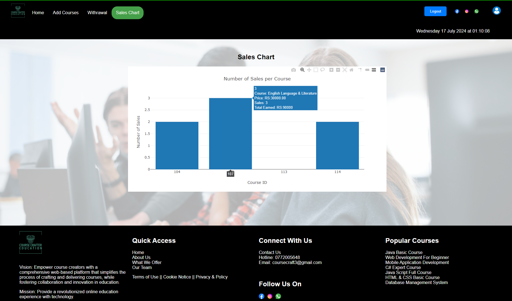
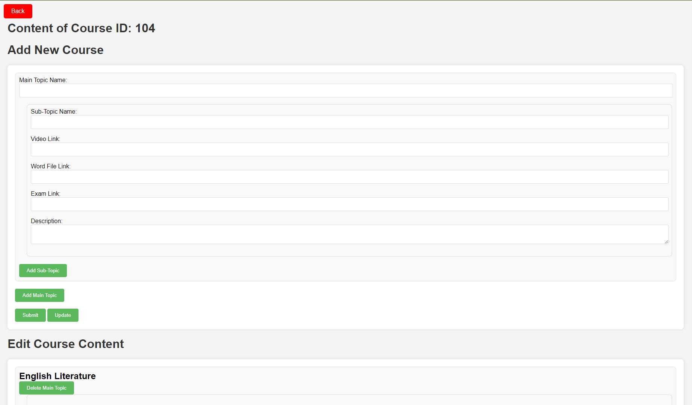

# CourseCrafters

## Overview

CourseCrafters is a robust online platform designed for creating, managing, and selling courses. It provides educators and institutions with all the tools necessary to offer engaging and effective online learning experiences. With a focus on user-friendliness and flexibility, CourseCrafters aims to simplify the process of course creation and monetization.

## Features

- **User-Friendly Interface**: Intuitive and responsive design for a smooth user experience.
- **Course Management**: Create, edit, and organize courses with ease.
- **Category Dropdown**: Interactive category dropdown menu for easy navigation.
- **Alert Notification**: One-time alert for successful course approval and redirection.
- **Multi-Level Course Structure**: Supports beginner, intermediate, and expert levels for comprehensive course management.
- **Secure Transactions**: Secure payment gateways and transaction handling.
- **User Authentication**: Robust user authentication and data protection mechanisms.
- **Analytics Dashboard**: Track sales, user engagement, and other key metrics.
- **Lecturer Management**: Add, edit, and manage lecturers who create and deliver courses.
- **Student Management**: Enroll, manage, and track student progress within courses.

## Technologies Used

- **Backend**: PHP, MySQL
- **Frontend**: HTML, CSS, JavaScript

## Screenshots






## Getting Started

### Prerequisites

- PHP
- MySQL
- Apache or any web server
- npm

### Installation

1. **Clone the repository**:
    ```bash
    git clone https://github.com/kavindurs8/CourseCrafters
    ```

2. **Navigate to the project directory**:
    ```bash
    cd CourseCrafters
    ```

3. **Set up the database**:
    - Create a MySQL database.
    - Import the provided SQL file into the database.

4. **Configure the project**:
    - Update the database configuration in the `config.php` file.

5. **Install dependencies**:
    ```bash
    npm install
    ```

6. **Start the development server**:
    ```bash
    npm start
    ```

7. **Open your browser** and navigate to `http://localhost:3000` to see the project in action.

## Usage

- **Creating Courses**: Use the intuitive interface to add new courses and manage existing ones.
- **Navigating Categories**: Hover over the "Category" menu to view available courses by level.
- **Selling Courses**: Set prices, manage discounts, and handle transactions securely.
- **Approval Alerts**: Receive a confirmation alert upon successful course creation or approval.
- **Tracking Performance**: Use the analytics dashboard to monitor sales and user engagement.
- **Managing Lecturers**: Assign courses to lecturers and monitor their contributions.
- **Managing Students**: Enroll students into courses, track their progress, and manage their interactions.

## Group Members

- **Kavindu Rasanjana**
- **Pavithra Premarathne**
- **Gayan Aththanayaka**

## Contributing

We welcome contributions! Please follow these steps to contribute:

1. **Fork the repository**.
2. **Create a new branch**:
    ```bash
    git checkout -b feature/your-feature-name
    ```
3. **Make your changes**.
4. **Commit your changes**:
    ```bash
    git commit -m 'Add some feature'
    ```
5. **Push to the branch**:
    ```bash
    git push origin feature/your-feature-name
    ```
6. **Open a pull request**.

## License

This project is licensed under the MIT License - see the [LICENSE](LICENSE) file for details.

## Acknowledgments

- Thanks to all contributors who helped make this project possible.
- Special thanks to the open-source community for providing valuable resources and support.
